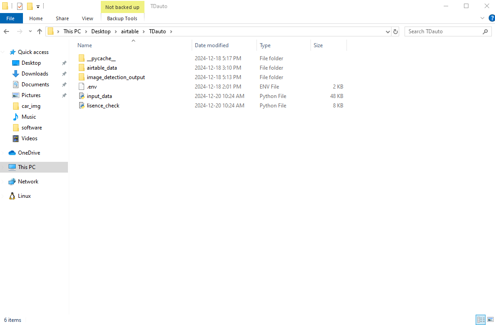
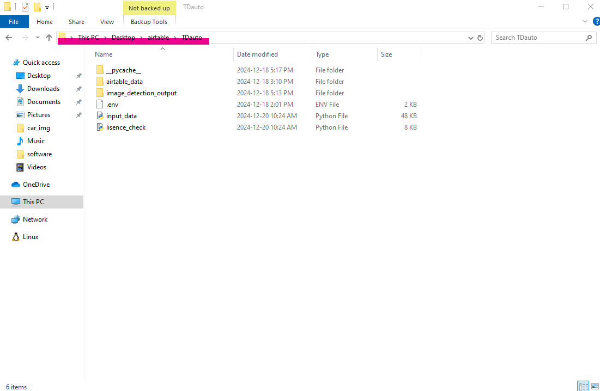
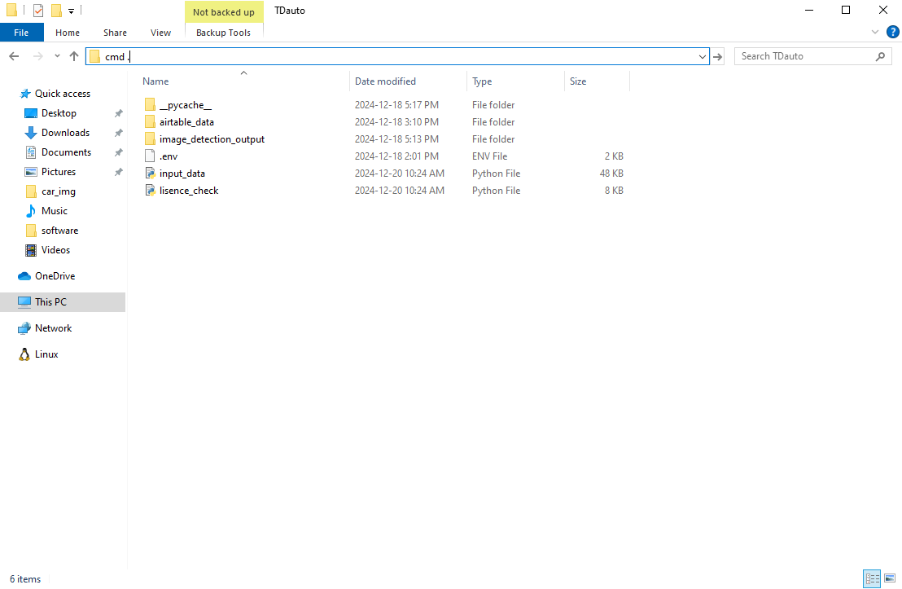
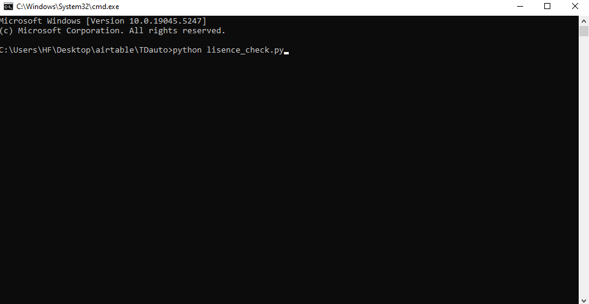

# 자동입력프로그램 사용방법

# 환경설정

<aside>
💡

py 파일을 실행하기 위해서 Python을 설치해야합니다. [다운로드링크](https://www.python.org/downloads/) <br>
웹사이트를 자동 조작하기 위해서 chromedriver를 설치해야합니다. [다운로드링크](https://sites.google.com/chromium.org/driver/downloads)

</aside>

<aside>
💡

자동입력 프로그램을 사용하기 위해서는 컴퓨터에 아래의 파일이 필요합니다.<br>
아래의 형태로 파일 및 폴더를 다운로드해주세요.

</aside>

```
프로그램폴더(폴더명변경가능)
├── TDauto
│   ├── input_data.py
│   ├── licence_check.py
│   ├── .env
│   ├── airtable_data
│   └── image_detection_output
│
├── scotiabank
│   ├── input_data.py
│   ├── licence_check.py
│   ├── .env
│   ├── airtable_data
│   └── image_detection_output
│
├── requirments.txt
└── visionapi-XXXXXXXXXX.json
```

<aside>
💡

.env 파일 수정이 필요합니다.<p>

.env 파일은 notepad 또는 메모장을 사용해서 수정할 수 있습니다.<p>

파일을 열었을 때 다음과 같은 텍스트를 볼 수 있습니다.<p>
”GOOGLE_APPLICATION_CREDENTIALS” 부분에 <br>
vision-api 파일경로를 따옴표 없이 복사 붙여넣기 해주세요.

</aside>

```
# Dealer track
BOSAUTO_ID=XXXXXXXX
BOSAUTO_PASS=XXXXXXX

# GCP
GOOGLE_APPLICATION_CREDENTIALS=C:\Users\Desktop\airtable\visionapi-XXXXX-XXX.json
```

<aside>
💡

Dealer track 부분에서 ID와 PASSWORD를 변경할 수 있습니다.

</aside>

# 방법 1.

1. Lender의 종류에 따라서 원하는 Bank 이름의 폴더에서 [licence.py](http://licence.py) 파일을 더블 클릭해주세요.
2. 지시에 따라서 고객 전화번호, 딜러쉽을 선택한 뒤 엔터를 입력하세요.
3. 인터넷 창이 열리고 자동 입력 프로그램이 실행됩니다.

# 방법 2.

1. Lender의 종류에 따라 해당 Lender 이름 폴더를 열어줍니다.
여기서는 TDauto를 예시로 설명하겠습니다.
    
    
    
2. 파일탐색기 경로를 클릭하고 “cmd .” 입력 후 엔터를 클릭합니다. 





1. cmd 창이 뜨고 경로가 `c:\User\….\TDauto`가 맞다면 `python lisence_check.py`를 입력 후 
엔터를 눌러줍니다.
    
    
    

4.인터넷 창이 열리고 자동 입력 프로그램이 실행됩니다.
